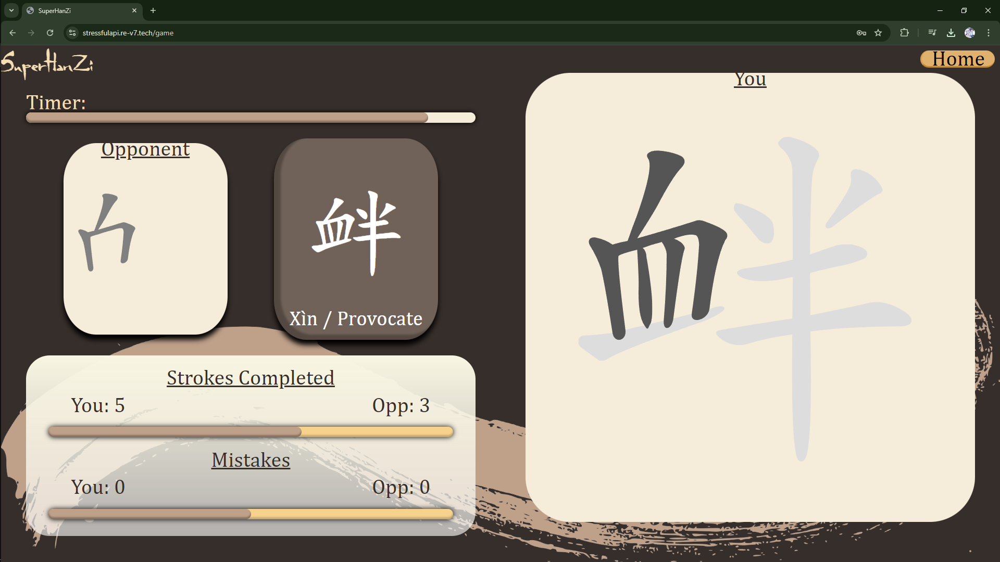
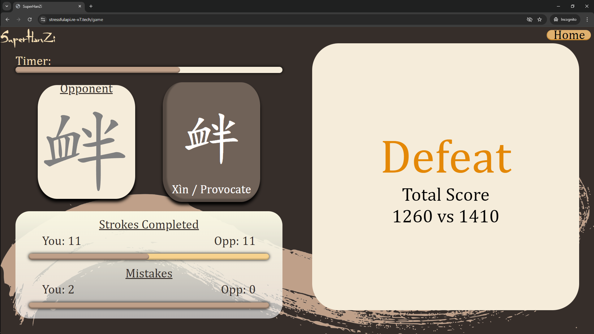

## SuperHanZi

### Team members

frans.budiman@mail.utoronto.ca  
mario.liao@mail.utoronto.ca  
pantysh.ghurburrun@mail.utoronto.ca

### Description

The proposal of our web application is to create a Chinese writing app, where new Chinese learners can learn how to write the Chinese characters. When the user is practcing or learning a Chinese character, our app will give the user feedback, to whether or not they have done the correct stroke order, the generally correct stroke, and the position of the start of the stroke. Along with users being able to “learn” and “review” Chinese characters, we will have an additional feature where users can play a game. This game will be a 1 vs 1 game, where the app will score the users based on their speed of, the amount of mistakes they made, and how many strokes they can finish within the allotted time.

### Tech Stack

- Frontend: Angular
- Backend: Express
- Database: postgreSQL
- Third-party API:
  - https://hanziwriter.org/docs.html
- OAuth 2.0 for user auth/sign-in using social media accounts
- Stripe for payment and its webhook to notify our server
- Real time game created using websockets to establish 2-way communication

### Video Demo

https://youtu.be/Df_fSgpUye0

### Screenshots

Sign in/sign up:

Home page:

Character selection page (first page):

Learning new character:

Practing character:

Finding game and game options setup:

Playing game and scoring:

